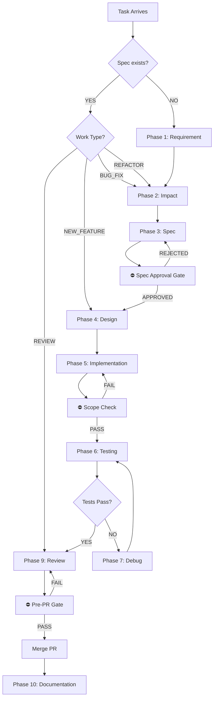

# Workflow Orchestrator v1.0

## 🎯 PRIMARY ENTRY POINT

Welcome! This is the **master workflow coordinator** for the AI-assisted Developer Workflow. Start here for any task.

**Use Cases**:
- New feature development
- Bug fixing
- Code refactoring
- Code review
- Emergency hotfixes

---

## ⚡ Quick Start

### For New Tasks (30 seconds)

**1. Gather Input**
```
Task: [Feature / Bug / Refactor / Review]
Description: [What needs to happen?]
Spec exists? [Yes/No]
Urgency: [Normal / Hotfix / Emergency]
```

**2. Invoke Orchestrator**
```
Execute orchestrator with inputs above
```

**3. Follow Routing**
Orchestrator automatically:
- Routes to correct workflow phase
- Loads relevant instructions
- Manages approvals/gates
- Tracks progress

---

## 🔀 Workflow Routing Logic



---

## 📋 Workflow Phases Overview

| Phase | Time | Tokens | Gate | Skip? | Agent |
|---|---|---|---|---|---|
| 1. Requirement | 10m | 500 | - | - | Requirement |
| 2. Impact | 10m | 700 | - | ✓ | Impact |
| 3. Spec | 30m | 900 | ⛔ Approval | ✓ | Spec |
| 4. Design | 15m | 900 | - | ✓ | Design |
| 5. Implementation | 45m | 1200 | ⛔ Scope | - | Implementation |
| 6. Testing | 20m | 900 | - | - | Test |
| 7. Debug | Varies | 900 | - | ✓ | Debug |
| 8. Refactor | 15m | 1000 | - | ✓ | Design |
| 9. Review | 20m | 1500 | ⛔ Readiness | - | Review |
| 10. Documentation | 20m | 700 | - | ✓ | Documentation |

---

## 🚀 Workflow Activation

### Step 1: Determine Workflow Type

#### Type A: New Feature (No Spec)
**Duration**: 2-4 hours  
**Tokens**: ~4000  
**Path**: REQ → IMPACT → SPEC ⛔ → DESIGN → IMPL ⛔ → TEST → REVIEW ⛔ → DOCS  

**Entry**:
```
Type: NEW_FEATURE
Requirement: [Feature description]
Spec exists? NO
Urgency: NORMAL
```

**Next**: Phase 1 (Requirement Agent)

---

#### Type B: Feature (Spec Exists)
**Duration**: 1-3 hours  
**Tokens**: ~2000  
**Path**: DESIGN (optional) → IMPL ⛔ → TEST → REVIEW ⛔ → DOCS  

**Entry**:
```
Type: NEW_FEATURE
Spec path: specs/feature-name.md
Urgency: NORMAL
```

**Next**: Phase 4 (Design Agent - optional)

---

#### Type C: Bug Fix
**Duration**: 1-2 hours  
**Tokens**: ~2500  
**Path**: REQ → IMPACT → SPEC (mini) ⛔ → IMPL ⛔ → TEST → DEBUG (if needed) → REVIEW ⛔ → DOCS  

**Entry**:
```
Type: BUG_FIX
Description: [Bug description]
Spec exists? NO
Urgency: NORMAL
```

**Next**: Phase 1 (Requirement Agent)

---

#### Type D: Code Review
**Duration**: 30 mins  
**Tokens**: ~900  
**Path**: REVIEW ⛔ → DOCS (optional)  

**Entry**:
```
Type: REVIEW
PR link: [GitHub/GitLab PR]
Urgency: NORMAL
```

**Next**: Phase 9 (Review Agent)

---

#### Type E: Hotfix (Emergency)
**Duration**: 30-60 mins  
**Tokens**: ~1500  
**Path**: REQ (fast) → IMPACT (fast) → IMPL ⛔ (skip spec) → TEST → REVIEW ⛔ → DOCS (minimal)  

**Entry**:
```
Type: HOTFIX
Description: [Emergency issue]
Urgency: EMERGENCY
Approval: [Manager name]
Incident: [Ticket ID]
```

**Next**: Phase 1 (fast requirement analysis)  
**Note**: Spec approval bypassed, logged to memory

---

### Step 2: Load Relevant Instructions

Based on workflow type, load:

**For NEW_FEATURE** → Load:
- instructions/workflow/lifecycle-routing.md
- instructions/core/coding-standards.md
- instructions/core/approval-rules.md
- instructions/token-optimization/context-loading-strategy.md

**For BUG_FIX** → Load:
- instructions/workflow/lifecycle-routing.md (bug-fix path)
- instructions/core/memory-usage.md
- instructions/developer/testing-rules.md

**For CODE_REVIEW** → Load:
- instructions/workflow/gate-definitions.md (review gate)
- instructions/developer/review-rules.md
- instructions/core/approval-rules.md (pre-PR gate)

**For HOTFIX** → Load:
- instructions/workflow/lifecycle-routing.md (hotfix path)
- instructions/core/approval-rules.md (gate bypass logging)
- instructions/workflow/phase-constraints.md (emergency mode)

---

### Step 3: Load Relevant Context

**For all workflows** → Optionally Load:
- Spec (if exists): specs/[feature-name].md
- Related memory: memory/[relevant category]/
- Codebase structure: architecture docs
- Related tests: test files (if available)

**Memory Loading Strategy**:
```
Load memory by keyword:
  keywords: [relevant terms]
  max_results: 5
  sort_by: recency
  
Example:
  Load from memory/incidents/
  Keywords: "payment", "timeout"
  Returns: Most recent 5 timeout-related payment bugs
```

---

### Step 4: Execute Phase

**Phase Structure**:
```
Phase X: [Name]
Agent: [Agent Name]
Input: [What agent receives]
Output: [What agent produces]
Gate: [If applicable]
Time: [Expected duration]

Status: [Starting] → [In Progress] → [Complete] → [Next Phase]
```

**Phase Execution Template**:
```
=== Phase Y: [Phase Name] ===

Input:
  - [Input 1]
  - [Input 2]

Agent: [Agent]
Budget: [Token limit] tokens
Time: [Time limit]

Executing...

Output:
  - [Output 1]
  - [Output 2]

Gate Check: [If applicable]
  ✓ Pass → Proceed to Phase [N+1]
  ✗ Fail → [Recovery action]

Memory: [Save findings? To which memory file?]

Status: COMPLETE → Next phase: Phase [N+1]
```

---

## 🎛️ Control Flow

### Successful Phase Completion
```
Phase complete & output generated
    ↓
Gate check (if applicable)
    ├─ PASS → Save to memory → Next phase
    └─ FAIL → Recovery action → Retry or escalate
```

### Gate Failure Recovery
```
Gate FAILS
    ↓
Reason: [Gate-specific failure reason]
    ↓
Recovery path:
  - Spec gate → Author revises spec → Re-approval
  - Scope gate → Update scope → Re-check
  - Review gate → Address findings → Re-submit
  - Readiness gate → Fix issues → Re-run
```

### Error Handling
```
Phase error occurs
    ↓
Retry logic:
  Attempt 1 → Same approach
  Attempt 2 → Different parameters
  Attempt 3 → Different agent
  Attempt 4 → Escalate to human
  Attempt 5 → Require manual intervention
```

---

## 🧠 Memory Integration

### Memory Save Points

| Phase | Saves To | Format |
|---|---|---|
| 1. Requirement | memory/workflows/ | Requirement summary |
| 2. Impact | memory/decisions/ | Impact analysis |
| 3. Spec | specs/ + memory/specs/ | Approved spec |
| 4. Design | memory/decisions/ | Design decisions |
| 5. Implementation | memory/decisions/ | Implementation notes |
| 6. Testing | memory/workflows/ | Test coverage notes |
| 7. Debug | memory/incidents/ | Root cause + fix |
| 8. Refactor | memory/patterns/ | New patterns discovered |
| 9. Review | memory/decisions/ | Review findings |
| 10. Documentation | memory/workflows/ | Deployment notes |

### Memory Loading

**Pre-task context load**:
```
Load from memory:
  1. Spec (if exists) → specs/
  2. Related decisions → memory/decisions/
  3. Related bugs → memory/incidents/
  4. Related patterns → memory/patterns/

Max 10 files loaded
Sort by: Relevance + Recency
```

---

## ⛔ Gate System

### Gate Locations

```
Phase 3 (Spec) → Spec Approval Gate ⛔
  Required before Phase 4
  Cannot bypass (hard stop)
  Approver: Team lead
  Duration: 2-24 hours

Phase 5 (Implementation) → Scope Check Gate ⛔
  Required before implementation
  Cannot bypass without logging
  Enforcer: Implementation Agent (automated)
  Duration: Immediate

Phase 9 (Review) → Pre-Review Spec Alignment ⛔
  Check code aligns with spec
  Automatic failure triggers fixes
  Enforcer: Review Agent
  Duration: Immediate

Phase 9 (Review) → Pre-PR Readiness Gate ⛔
  Tests + Linter + Coverage + Docs
  Cannot merge without passing
  Enforcer: CI/CD (automated)
  Duration: 1-2 hours
```

### Gate Override (Rare)
```
Emergency detected → Request override
  Provided: Justification + VP approval
  Logged: memory/incidents/overrides.md
  Post-review: Within 24 hours
```

---

## 🛠️ Tool Generation

This orchestrator is **tool-agnostic**. Tool-specific variations are generated:

### Tool-Specific Workflows

| Tool | Workflow File | Based On |
|---|---|---|
| GitHub Copilot | .github/copilot-instructions.md | orchestrator |
| Claude | CLAUDE.md | orchestrator |
| Cursor | .cursorrules | orchestrator |
| Cline | .clinerules | orchestrator |
| Continue | .continue/config.yaml | orchestrator |
| Windsurf | .windsurfrules | orchestrator |

**Generation Rule**: Tool workflows are auto-generated from this orchestrator. Do not manually edit tool files; update orchestrator instead.

---

## 📊 Workflow Metrics

### Track Per Workflow
```
=== Workflow Metrics ===
Type: [Feature/Bug/Review]
Start time: [When started]
End time: [When completed]
Total time: [Duration]
Total tokens: [Tokens used]
Phases skipped: [Which phases]
Gate failures: [How many + reasons]
Memory saved: [What was saved]
Efficiency score: [% vs budget]
```

### Monthly Report
```
Total workflows: [N]
Average time: [X hours]
Average tokens: [Y]
Gate pass rate: [%]
Bypass rate: [%]
Success rate: [%]
```

---

## 🔧 Configuration

### Phase Token Budgets (Tunable)
```
phase_budgets:
  requirement: 500      # Can change to 600
  impact: 700          # Can change to 800
  spec: 900           # Can change to 1000
  design: 900         # Can change to 1200
  implementation: 1200 # Can change to 1500
  testing: 900        # Can change to 1200
  debug: 900          # Can change to 1500
  refactor: 1000      # Can change to 1200
  review: 1500        # Fixed (hard limit)
  documentation: 700  # Can change to 900
```

### Phase Time Budgets (Tunable)
```
phase_times:
  requirement: 10m     # Can adjust
  impact: 10m         # Can adjust
  spec: 30m           # Can adjust (approval wait: 2-24h separate)
  design: 15m         # Can adjust
  implementation: 45m # Can adjust
  testing: 20m        # Can adjust
  debug: varies       # No limit
  refactor: 15m       # Can adjust
  review: 20m         # Can adjust (approval wait: 1-2h separate)
  documentation: 20m  # Can adjust
```

### Gate Approval Times (Tunable)
```
gate_approvals:
  spec_approval: 24h max
  scope_check: immediate
  review_gate: immediate
  readiness_gate: 3h max
```

---

## 📚 Documentation References

### Core Instructions
- [Architecture Principles](instructions/core/architecture.md)
- [Coding Standards](instructions/core/coding-standards.md)
- [Approval Rules](instructions/core/approval-rules.md)
- [Memory Usage](instructions/core/memory-usage.md)

### Workflow Instructions
- [Lifecycle Routing](instructions/workflow/lifecycle-routing.md)
- [Gate Definitions](instructions/workflow/gate-definitions.md)
- [Phase Constraints](instructions/workflow/phase-constraints.md)

### Optimization
- [Token Optimization](instructions/token-optimization/context-loading-strategy.md)

### Agents
- [Requirement Agent](agents/requirement.agent.md)
- [Impact Agent](agents/impact.agent.md)
- [Spec Agent](agents/spec.agent.md)
- [Design Agent](agents/design.agent.md)
- [Implementation Agent](agents/implementation.agent.md)
- [Test Agent](agents/test.agent.md)
- [Debug Agent](agents/debug.agent.md)
- [Review Agent](agents/review.agent.md)
- [Documentation Agent](agents/documentation.agent.md)

### Hooks
- [Pre-Task Context Load](hooks/pre-task/context-load.prompt.md)
- [Spec Approval Gate](hooks/spec/approval-gate.prompt.md)
- [Implementation Hooks](hooks/implementation/)
- [Review Hooks](hooks/review/)
- [Quality Hooks](hooks/quality/)

### Memory
- [Memory Templates](memory/) - Bugs, Decisions, Patterns, Specs
- [Obsidian Integration](ai-memory/) - Linked memory system

---

## ✅ Quick Checklist

**Before Starting**:
- [ ] Task type identified (Feature/Bug/Review/Hotfix)
- [ ] Urgency level set (Normal/Hotfix/Emergency)
- [ ] Existing spec located (if applicable)
- [ ] Affected files scoped

**During Workflow**:
- [ ] Load relevant instructions
- [ ] Follow phase routing
- [ ] Respect gates (cannot bypass soft gates)
- [ ] Save findings to memory

**After Workflow**:
- [ ] All gates passed
- [ ] Memory updated
- [ ] PR merged (if applicable)
- [ ] Documentation complete
- [ ] Metrics logged

---

## 🚨 Emergency Procedures

### Production Outage
```
Incident: [Description]
VP Approval: [Name]
Bypass: Spec gate ⛔ (logged)

Fast path:
  REQ (5min) → IMPL (15min) → TEST (10min) → REVIEW (5min) → DEPLOY
  Total: 35 minutes vs 3+ hours normal path
```

### Security Incident
```
Incident: [Description]
CISO Approval: [Name]
Bypass: All gates except pre-PR readiness (tests must pass)

Secure path:
  REQ → IMPL → TEST (100% required) → SECURITY REVIEW (2h) → DEPLOY
```

---

## 📞 Support

**Questions?**
- See [instructions/core/architecture.md](instructions/core/architecture.md) for system overview
- See [instructions/workflow/lifecycle-routing.md](instructions/workflow/lifecycle-routing.md) for phase details
- See [hooks/README.md](hooks/README.md) for hook system
- See [memory/README.md](memory/README.md) for memory system

**Issues?**
- Check memory/incidents/ for similar issues
- See [instructions/core/approval-rules.md](instructions/core/approval-rules.md#escalation--appeals) for escalation process
- Contact team lead for guidance

---

## 🎯 Summary

The Workflow Orchestrator is your central hub for:

1. ✅ **Task routing** - Goes to correct workflow
2. ✅ **Context loading** - Loads relevant instructions/memory
3. ✅ **Phase execution** - Each phase runs with agent + constraints
4. ✅ **Gate enforcement** - Hard stops at critical points
5. ✅ **Memory management** - Saves findings for reuse
6. ✅ **Tool generation** - Exports to Copilot, Claude, Cursor, etc.
7. ✅ **Metrics tracking** - Measures efficiency

**Start here. Follow phases. Trust the gates. Save to memory.**
